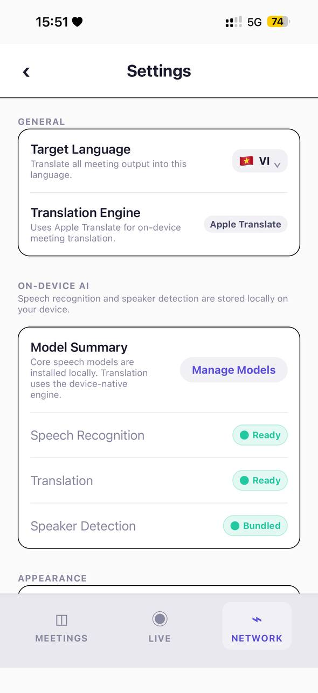
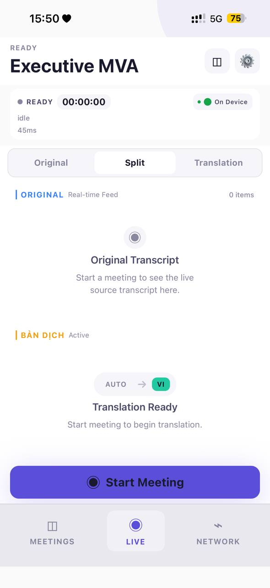
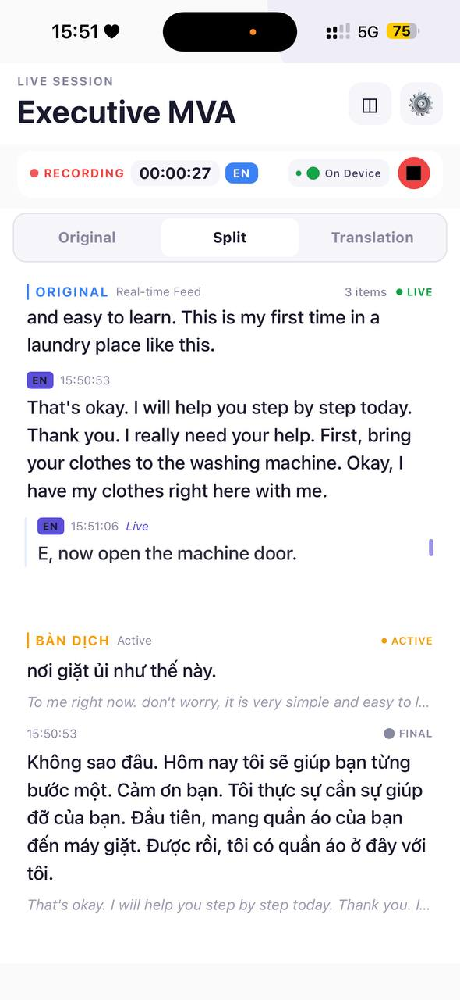
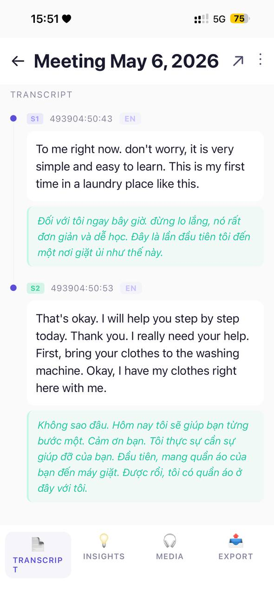

# MVA (VibeVoice)


Mobile voice assistant for multilingual meetings.
Private, offline-first, and built for teams that need fast transcription, translation, and post-meeting review directly on device.

If you care about on-device AI, privacy-aware mobile UX, or multilingual meeting products, this repo is worth exploring.
If this project is useful, consider giving it a star to support future development.

## Overview

MVA is a mobile product for capturing and understanding conversations in multilingual meetings.
It focuses on a local-first workflow: record what matters, turn speech into structured meeting content, translate across languages, and make the session easy to review afterward.

Unlike many meeting tools that depend heavily on cloud-only pipelines, MVA explores a more privacy-aware approach with on-device AI workflows, native mobile UX, and local model lifecycle management.

## Why MVA is interesting

- Built for multilingual meeting scenarios
- Offline-first product direction
- On-device speech workflow integration
- React Native app with native iOS bridges
- Local AI model management inside mobile UX
- Release build already validated on a physical iPad

## Why clone this repo

Clone this repo if you want to study or build:
- on-device speech products on mobile
- multilingual meeting assistants
- React Native apps with native AI integration
- private, local-first product workflows
- mobile UX for transcript, translation, and review

## Core capabilities

### Live meeting workspace
- Live transcript lane
- Translation lane
- Meeting status bar
- Active session state handling

### Session history and review
- Browse saved sessions
- Review transcripts after meetings
- Generate recap content
- Export transcript artifacts

### Local AI model lifecycle
- Browse available models
- Download and cache models
- Track readiness and progress
- Remove local assets when needed

### Startup readiness flow
- Bootstrap checks for app state
- Prewarm visibility
- Server connectivity status
- Actionable degraded and failure states

## Product highlights

- Mobile-first experience
- Privacy-aware local-first direction
- On-device speech-to-text pipeline
- Real-time translation flow
- Meeting review workflow
- Native iOS integration points
- Model management UX built into app

## Feature checklist

- [x] Multilingual meeting workflow
- [x] Local-first mobile architecture
- [x] Transcript and translation experience
- [x] Session review flow
- [x] Local model management
- [x] iOS release build validation
- [ ] Demo video
- [ ] Public test build
- [ ] One-command model setup

## App screens

- Splash / bootstrap readiness
- Meeting screen
- History list
- Session review
- Model repository
- Settings

## Screenshots

| Settings | Meeting |
|---|---|
|  |  |

| Session Review | Home |
|---|---|
|  |  |

## Tech stack

- React Native 0.85
- React 19
- TypeScript
- React Navigation 7
- TanStack Query 5
- Zustand
- Swift / Objective-C bridge on iOS
- `react-native-sherpa-onnx` for on-device inference integration

## Repository structure

```text
.
└── mobile/
    ├── src/
    │   ├── app/
    │   ├── features/
    │   │   ├── bootstrap/
    │   │   ├── history/
    │   │   ├── meeting/
    │   │   ├── models/
    │   │   └── settings/
    │   ├── native/
    │   └── shared/
    ├── ios/
    └── android/
```

## Quick start

### Requirements
- Node.js 20+
- Xcode for iOS
- Android Studio for Android
- CocoaPods for iOS dependencies

### Install and start

```bash
cd mobile
npm install
npm run start
```

### Run on iOS

```bash
cd mobile
npm run ios
```

### Run iOS release build

```bash
cd mobile
npm run ios:release
```

### Run on Android

```bash
cd mobile
npm run android
```

### Build Android release

```bash
cd mobile
npm run build:android:release
```

## Quality checks

```bash
cd mobile
npm run lint
npm run typecheck
npm test
```

## Notes for cloning

Large local model artifacts and machine-specific files are intentionally excluded from git history.
If you want full offline AI flows, prepare local model assets separately after cloning.

## Who this repo is for

This repo is a good fit for:
- Engineers exploring on-device AI on mobile
- Product teams prototyping multilingual meeting assistants
- Developers learning React Native plus native bridge integration
- Builders interested in privacy-aware speech products

## Roadmap

- Better diarization UX
- Richer meeting summaries
- More export formats
- Easier model setup
- Stronger Android and iPad production polish

## Support this project

If MVA gave you ideas for your own app, helped your research, or saved you implementation time:
- star repo
- watch updates
- open issue with feedback
- share with teammates building AI mobile products

## Contributing

Issues and pull requests are welcome.

