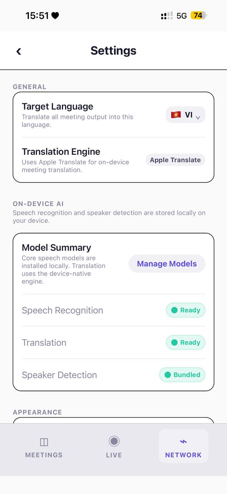
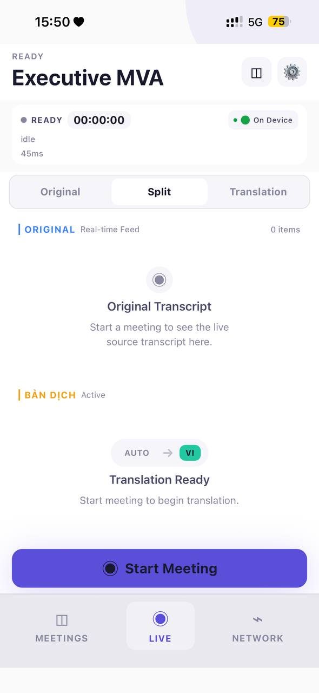
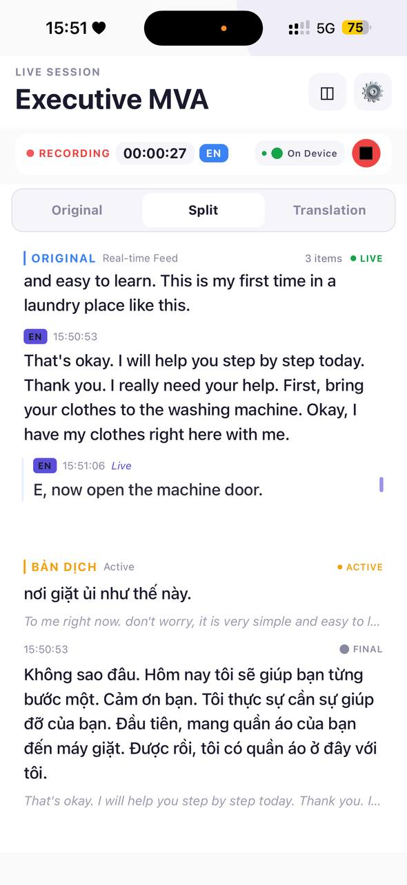
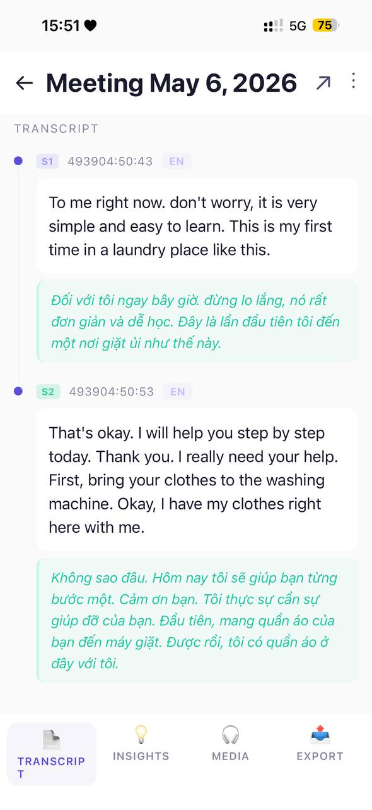

# Mobile Voice Assistant


Mobile voice assistant for multilingual meetings.
Transcription, translation, and speaker attribution run on the phone — meeting audio never leaves the device.

If you care about on-device AI, privacy-aware mobile UX, or multilingual meeting products, this repo is worth exploring.

## Overview

MVA captures a multilingual meeting, transcribes it, translates it, attributes each utterance to a speaker, and turns the result into something reviewable afterwards. All of that happens on the device.

Unlike meeting tools that stream audio to a cloud pipeline, MVA keeps the entire meeting path local: on-device speech recognition, platform-native translation engines, embedding-based speaker clustering, and encrypted local storage.

**One honest caveat up front:** the app is offline *during meetings*, not offline in absolute terms. Translation language packs (Apple on iOS, Google ML Kit on Android) are downloaded once during setup. After that, a meeting runs fine in airplane mode. There is no backend, no telemetry, and no meeting content ever leaves the phone.

## Core capabilities

### Live meeting workspace
- Transcript lane and translation lane, with a split/single toggle
- Language badges (EN/JA/KO/ZH/VI) and speaker badges (S1/S2/S3…)
- Draft translations for in-progress speech, promoted when the utterance finalizes
- Recording indicator, session timer, auto-scroll with jump-to-latest
- Capture survives screen lock and backgrounding
- Optional spoken read-back of the translation lane

### Session history and review
- Browse saved sessions with date, duration, languages, and speaker count
- Review tabs: Transcript · Insights · Media · Export
- Deterministic recap — key points, key moments, speaker and language statistics, each labeled with the rule that produced it
- Recalculate speakers on a saved session
- Export transcript, recap, or full minutes as Markdown

### On-device engines
- **STT (auto):** SenseVoice-Small int8 — EN/JA/KO/ZH — with inverse text normalization
- **STT (Vietnamese):** Zipformer-VI int8 offline transducer, selected in Settings
- **Translation:** Apple Translation Framework (iOS) · Google ML Kit Translate (Android)
- **Speaker diarization:** CAM++ 192-dim embeddings, clustered in TypeScript
- **Recap:** rule-based TypeScript — no AI, no LLM, no cloud

### Setup and readiness
- Bundled models installed from the app bundle on first launch
- Language-pack setup with per-pair status
- Readiness surface before Start: model, prewarm, translator, and missing-pack states, each with an action

## App screens

Splash / bootstrap · Meeting · History (home) · Session review · Model repository · Settings

## Screenshots

| Settings | Meeting |
|---|---|
|  |  |

| Session Review | Home |
|---|---|
|  |  |

## Tech stack

- React Native 0.85, React 19, TypeScript 5.6
- Zustand 5 for state
- i18next — the UI itself ships in Vietnamese, English, Japanese, Korean, and Chinese
- `react-native-sherpa-onnx` for on-device inference
- Swift / Objective-C native modules on iOS, Kotlin on Android
- Encrypted local storage: AsyncStorage (Android) / JSON files (iOS), AES-GCM with keys in Keychain / Keystore

## Repository structure

```text
.
├── bench/                      # Phase 0 STT benchmark harness + results
├── docs/
│   ├── planning-artifacts/     # PRD · architecture · epics · UX spec
│   └── implementation-artifacts/
└── mobile/
    ├── src/
    │   ├── app/                # navigation
    │   ├── features/           # bootstrap · meeting · history · models · settings
    │   ├── native/             # stt · vad · speaker · tts · models · bridges
    │   ├── services/           # translation · persistence · speaker · tts
    │   ├── shared/             # store · theme · components · utils
    │   └── i18n/
    ├── ios/
    └── android/
```

## Quick start

### Requirements
- Node.js 20+
- Xcode for iOS (deployment target 18.0)
- Android Studio for Android (minSdk 24, target 36)
- CocoaPods for iOS dependencies

### Install and start

```bash
cd mobile
npm install
npm run start
```

### Run

```bash
npm run ios                    # iOS debug
npm run ios:release            # iOS release
npm run android                # Android debug
npm run build:android:release  # Android release APK
```

### Quality checks

```bash
npm run lint
npm run typecheck
npm test
```

## Model assets

Model binaries are gitignored — a fresh clone has the folder structure and READMEs but no `.onnx` files.

`mobile/scripts/copy-required-model-assets.js` downloads the archives from the [sherpa-onnx releases](https://github.com/k2-fsa/sherpa-onnx/releases) and is wired into the Xcode build phase, so an iOS build fetches them automatically. For Android, place them under `mobile/android/app/src/main/assets/models/`.

| Model | Purpose | Disk |
|-------|---------|------|
| `sherpa-onnx-sense-voice-zh-en-ja-ko-yue-int8-2024-07-17` | STT, EN/JA/KO/ZH | ~234MB |
| `sherpa-onnx-zipformer-vi-int8-2025-04-20` | STT, Vietnamese | ~74MB |
| `speaker-diarization/` | Segmentation placeholder + CAM++ embedding | ~35MB |

Translation adds nothing to the bundle — it uses the platform language packs.

## Benchmarks

Vietnamese STT was chosen from measurement, not assertion. FLEURS-vi, 200 utterances, Mac CPU, 4 threads:

| Model | WER | RTF | Verdict |
|---|---:|---:|---|
| `zipformer-vi` (Apache-2.0) | **10.09%** | 0.025 | Chosen |
| `zipformer-vi-30m` (CC-BY-NC-ND) | 9.51% | 0.023 | Better, but not shippable |
| `sense-voice` | 99.71% | 0.046 | Unusable for Vietnamese |
| `omnilingual-300m` | 26.77% | 0.234 | Rejected |

See [`bench/README.md`](bench/README.md) to reproduce, including how to run the harness against your own meeting audio.

## Project status

Feature-complete for a demo. **Not validated for release.**

The Vietnamese WER above is the only measured number in this project, and FLEURS is clean read speech — an optimistic upper bound by construction. On-device RTF, end-to-end latency, RAM, and battery drain have not been measured on a phone, and the formal go/no-go gate (WER on consented real meeting audio) has not been run. That work is tracked as Epic 8 in [`docs/planning-artifacts/epics.md`](docs/planning-artifacts/epics.md).

## Documentation

| Document | What it covers |
|---|---|
| [PRD](docs/planning-artifacts/prd.md) | Requirements, status per requirement, decision log |
| [Architecture](docs/planning-artifacts/architecture.md) | Components, data flow, ADRs, known debt |
| [Epics](docs/planning-artifacts/epics.md) | Story status across nine epics |
| [Story catalog](docs/implementation-artifacts/index.md) | Per-story status, and which story files are stale |
| [Project context](docs/project-context.md) | Orientation, and the traps new contributors hit |

The PRD, architecture, epics, story index, and project context were reconciled against the code on 2026-08-17. The UX design specification has not been — it still describes an earlier version of the product.

## Roadmap

- Measure everything on device (Epic 8) — the blocker for any release commitment
- Real segmentation model for diarization, replacing the placeholder
- Action-item detection and topic segmentation in the recap
- SQLite migration for session storage
- Stronger Android and iPad polish

## Contributing

Issues and pull requests are welcome. If you change a threshold, a model, or a storage key, update `docs/planning-artifacts/architecture.md` in the same change — this repository has been through one documentation drift already.
