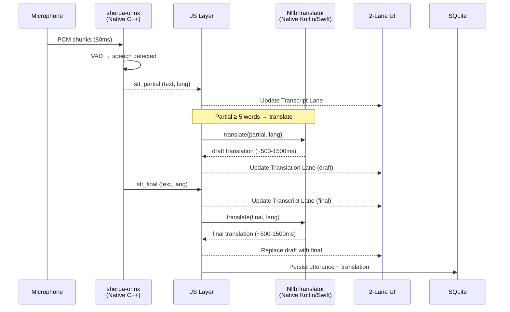

# Architecture Decision Document — Meeting Voice Assistant

**Author:** nghinh  
**Date:** 2026-04-13  
**Version:** 3.0 (Offline-Only)  
**Status:** Approved

---

## 1. Architecture Overview

### 1.1 Design Philosophy

**Everything on-device, nothing on the network.** MVA runs as a self-contained mobile application with zero server dependencies. All AI models execute on the phone's CPU/NPU. No audio or text ever leaves the device boundary.

### 1.2 High-Level Architecture

```
┌─────────────────────────────────────────────────────────────┐
│                    Mobile Device (React Native)              │
├─────────────────────────────────────────────────────────────┤
│  ┌──────────────────────────────────────────────────────┐   │
│  │                   JS Layer                            │   │
│  │  ┌─────────────┐ ┌──────────────┐ ┌──────────────┐  │   │
│  │  │  Zustand     │ │ Pipeline     │ │  UI (2-lane) │  │   │
│  │  │  Store       │ │ Orchestrator │ │  Transcript  │  │   │
│  │  └─────────────┘ └──────────────┘ │  Translation │  │   │
│  │                                    └──────────────┘  │   │
│  └────────────┬──────────────┬──────────────────────────┘   │
│               │ TurboModule  │ TurboModule                   │
│  ┌────────────▼──────────┐ ┌▼──────────────────────────┐   │
│  │  react-native-        │ │  NllbTranslatorModule     │   │
│  │  sherpa-onnx           │ │  (Custom TurboModule)     │   │
│  │  ┌──────────────────┐ │ │  ┌──────────────────────┐ │   │
│  │  │ Audio Capture     │ │ │  │ ONNX Runtime Mobile  │ │   │
│  │  │ (AVAudioEngine /  │ │ │  │ + NLLB-600M int8    │ │   │
│  │  │  AudioRecord)     │ │ │  │ + SentencePiece      │ │   │
│  │  ├──────────────────┤ │ │  └──────────────────────┘ │   │
│  │  │ Silero VAD        │ │ │  Execution Providers:     │   │
│  │  ├──────────────────┤ │ │  - NNAPI (Android)        │   │
│  │  │ SenseVoice-Small  │ │ │  - CoreML (iOS)           │   │
│  │  │ int8 (234MB)      │ │ │  - CPU/XNNPACK fallback   │   │
│  │  └──────────────────┘ │ └──────────────────────────┘   │
│  │  Native C++ Layer     │   Native Kotlin/Swift Layer     │
│  └───────────────────────┘ └──────────────────────────────┘ │
│                                                              │
│  ┌──────────────────────────────────────────────────────┐   │
│  │  Local Storage (SQLite)                               │   │
│  │  Sessions, Utterances, Translations, Settings         │   │
│  └──────────────────────────────────────────────────────┘   │
│                                                              │
│  ┌──────────────────────────────────────────────────────┐   │
│  │  Model Storage (~1GB)                                 │   │
│  │  sensevoice-small-int8/ (234MB)                       │   │
│  │  nllb-600m-int8/        (800MB compressed)            │   │
│  └──────────────────────────────────────────────────────┘   │
└─────────────────────────────────────────────────────────────┘

Network: NONE (airplane mode compatible)
Server: NONE
```

### 1.3 Data Flow — Single Utterance



---

## 2. Component Architecture

### 2.1 STT Component — react-native-sherpa-onnx

**Decision:** Use existing `react-native-sherpa-onnx` package (XDcobra, v0.3.3+). No custom native code for STT.

| Aspect | Detail |
|--------|--------|
| Package | `react-native-sherpa-onnx` v0.3.3+ |
| Architecture | TurboModule (New Architecture) |
| Model | SenseVoice-Small int8 (~234MB) |
| Languages | EN, JA, KO auto-detect |
| Audio | 16kHz mono PCM, 80ms chunks |
| VAD | Silero VAD (bundled), 32ms chunks |
| RTF | 0.05 (iPhone 15 Pro), 0.08 (Android flagship) |
| RAM | ~400-500MB |

**Audio pipeline stays entirely in native C++ layer.** Only text results cross the TurboModule bridge to JS.

### 2.2 Translation Component — NllbTranslatorModule (NEW)

**Decision:** Create a custom TurboModule wrapping ONNX Runtime Mobile for NLLB-600M.

| Aspect | Detail |
|--------|--------|
| Model | NLLB-200-distilled-600M int8 ONNX |
| Model files | `encoder_model_quantized.onnx` (~350MB), `decoder_model_quantized.onnx` (~200MB), `decoder_with_past_model_quantized.onnx` (~200MB), `sentencepiece.bpe.model` (~5MB) |
| Download size | ~800MB compressed |
| Runtime RAM | ~500-800MB |
| Inference | Greedy decoding (argmax), max_length=128 |
| KV Cache | Yes — via split decoder (no-cache + with-past) |
| Tokenizer | Pure Kotlin/Swift SentencePiece BPE (no JNI) |
| Execution Providers | NNAPI (Android), CoreML (iOS), CPU/XNNPACK fallback |
| Latency | ~500-1500ms per sentence (device-dependent) |

**Why split decoder into 2 ONNX files:**
- ONNX Runtime Mobile crashes with If-node in merged decoder
- `decoder_model_quantized.onnx` — runs for FIRST token only (no KV cache input)
- `decoder_with_past_model_quantized.onnx` — runs for subsequent tokens using KV cache from previous step
- This pattern is proven by both RTranslator and InstantVoiceTranslate

**Language code mapping:**

| Source | NLLB Code | Target | NLLB Code |
|--------|-----------|--------|-----------|
| English | `eng_Latn` | Vietnamese | `vie_Latn` |
| Japanese | `jpn_Jpan` | Vietnamese | `vie_Latn` |
| Korean | `kor_Hang` | Vietnamese | `vie_Latn` |

### 2.3 Pipeline Orchestrator

**Decision:** TypeScript orchestrator in JS layer coordinates STT events → translation → UI updates.

Key behaviors:
1. **STT partial (≥5 words)** → fire on-device translation, display as "draft" (lower opacity)
2. **STT final** → cancel any in-progress partial translation, fire final translation, display as confirmed
3. **Translation concurrency** — if new STT arrives while translation is running, cancel old translation (version counter pattern)
4. **Sequential resource access** — STT and NLLB share device CPU. STT runs continuously; NLLB runs on-demand between STT emissions. No contention because STT partial emissions are ~300ms apart, and NLLB runs during that gap.

### 2.4 Local Storage — SQLite

| Table | Columns | Purpose |
|-------|---------|---------|
| `sessions` | id, started_at, ended_at, status | Meeting sessions |
| `utterances` | id, session_id, text, lang, is_final, timestamp | STT results |
| `translations` | id, utterance_id, text, is_draft, latency_ms | Vietnamese translations |
| `settings` | key, value | User preferences |

### 2.5 UI Architecture

**2-lane layout** (down from 3-lane in previous architecture — AI suggest lane removed):

| Lane | Content | Color Accent |
|------|---------|-------------|
| Transcript | Original text (EN/JA/KO) with language badge + timestamp | Blue (#3B82F6) |
| Translation | Vietnamese translation (draft → final smooth replacement) | Amber (#F59E0B) |

State management: Zustand store with `utterances[]` array. Each utterance has optional `translation` field. UI components subscribe to specific utterance updates via selectors.

---

## 3. Key Architecture Decisions

### ADR-001: 100% Offline — No Server

**Context:** Previous architecture (v2.0-2.1) used self-hosted FastAPI server for NLLB-1.3B translation + vLLM for AI suggest. Network round-trip added 200-500ms latency.

**Decision:** Run all inference on-device. Remove all server components.

**Consequences:**
- (+) Zero network latency for translation
- (+) Works in airplane mode, no WiFi needed
- (+) Absolute privacy — nothing leaves device
- (+) No infrastructure to maintain
- (-) Translation quality slightly lower (600M vs 1.3B model)
- (-) Translation speed depends on device CPU (~500-1500ms vs ~50ms on GPU)
- (-) AI suggest feature dropped

### ADR-002: NLLB-600M over NLLB-1.3B

**Context:** NLLB-1.3B provides better translation quality but requires ~2GB RAM and ~3-5s inference on mobile CPU.

**Decision:** Use NLLB-200-distilled-600M (int8).

**Rationale:** 600M fits in ~500-800MB RAM alongside SenseVoice STT (~400-500MB). Total ~1.2GB is feasible on phones with 6GB+ RAM. BLEU score difference is ~2-4 points — acceptable for meeting comprehension (not certified translation).

### ADR-003: Greedy Decoding over Beam Search

**Decision:** Use argmax (greedy) decoding for on-device translation, not beam search.

**Rationale:** Beam search (beam=4) is 3-5x slower on CPU with minimal quality improvement for 600M model. For meeting context where speed matters more than literary translation quality, greedy decoding provides the best latency/quality tradeoff.

### ADR-004: Split Decoder Architecture

**Decision:** Split NLLB decoder into 2 separate ONNX files (no-cache + with-past).

**Rationale:** ONNX Runtime Mobile crashes on merged decoder containing If-nodes. Split architecture also enables KV cache which provides 5-10x speedup for longer sentences. This pattern is battle-tested by RTranslator (9.7K stars) and InstantVoiceTranslate.

### ADR-005: AI Suggest Removed from Scope

**Decision:** Remove AI response suggestion feature entirely.

**Rationale:** Running an LLM on-device (even Qwen2-0.5B at ~1GB) would push total RAM to ~2.2GB+, leaving insufficient headroom for OS and other apps. The core value proposition — understanding what meeting participants are saying — is fully served by STT + Translation alone.

---

## 4. Project Structure

```
meeting-voice-assistant/
├── android/
│   └── app/src/main/java/com/mva/nllb/
│       ├── NllbTranslatorModule.kt         # TurboModule entry
│       ├── NllbTranslatorHelper.kt         # ONNX Runtime inference
│       ├── SentencePieceTokenizer.kt       # Pure Kotlin BPE
│       └── NllbTranslatorPackage.kt        # Module registration
├── ios/
│   ├── NllbTranslatorModule.swift          # TurboModule entry
│   ├── NllbTranslatorHelper.swift          # ONNX Runtime inference
│   ├── SentencePieceTokenizer.swift        # Pure Swift BPE
│   └── NllbTranslatorModule.mm            # ObjC++ bridge
├── src/
│   ├── native/
│   │   └── NativeNllbTranslator.ts         # TurboModule TS interface
│   ├── hooks/
│   │   ├── useSherpaStream.ts              # STT streaming hook
│   │   └── useMeetingPipeline.ts           # Orchestrate STT → translate → UI
│   ├── services/
│   │   ├── OnDeviceTranslator.ts           # Wrap NllbTranslator with cancellation
│   │   ├── PipelineOrchestrator.ts         # Coordinate STT → translation
│   │   └── ModelManager.ts                 # Download + cache + warm-up
│   ├── screens/
│   │   ├── HomeScreen.tsx                  # Session list + Start button
│   │   ├── MeetingScreen.tsx               # 2-lane live view
│   │   ├── ReviewScreen.tsx                # Past session detail
│   │   └── SettingsScreen.tsx              # Model management + preferences
│   ├── components/
│   │   ├── TranscriptLane.tsx              # Original text lane
│   │   ├── TranslationLane.tsx             # Vietnamese translation lane
│   │   ├── SessionCard.tsx                 # Home screen session item
│   │   ├── LangBadge.tsx                   # EN/JA/KO badge
│   │   ├── DraftIndicator.tsx              # "draft" label for partial translations
│   │   └── ModelDownloadProgress.tsx       # First-launch download UI
│   ├── store/
│   │   ├── conversationStore.ts            # Zustand: utterances + translations
│   │   └── settingsStore.ts               # Zustand: user preferences
│   ├── db/
│   │   ├── schema.ts                       # SQLite table definitions
│   │   └── queries.ts                      # CRUD operations
│   └── App.tsx
├── models/                                  # Downloaded at first launch
│   ├── sensevoice-small-int8/              # STT (~234MB)
│   └── nllb-600m-int8/                     # Translation (~800MB)
├── scripts/
│   └── prepare_nllb_mobile.py             # Convert NLLB to ONNX for mobile
└── package.json
```

---

## 5. Resource Budget

### 5.1 Memory (RAM)

| Component | Estimated RAM | Notes |
|-----------|--------------|-------|
| SenseVoice-Small int8 | ~400-500MB | Loaded at app start |
| NLLB-600M int8 (encoder) | ~350MB | Loaded at app start |
| NLLB-600M int8 (decoders) | ~200MB | Shared memory with encoder |
| KV cache (decoder) | ~50-100MB | Dynamic, per-sentence |
| React Native runtime | ~80-100MB | JS engine + UI |
| SQLite + app data | ~20MB | Minimal |
| **Total** | **~1.1-1.3GB** | Target: ≤1.5GB on 6GB device |

### 5.2 Storage (Disk)

| Asset | Size | Notes |
|-------|------|-------|
| SenseVoice model | ~234MB | Downloaded once |
| NLLB model (compressed) | ~800MB | Downloaded once |
| App binary | ~30MB | Installed via APK/IPA |
| Session data | ~1-5MB/session | Grows over time |
| **Total initial** | **~1.1GB** | First launch |

### 5.3 Latency Budget

| Stage | Target | Maximum |
|-------|--------|---------|
| Audio chunk | 80ms | 80ms |
| VAD decision | 30ms | 50ms |
| STT partial | 200ms | 400ms |
| STT final | 200ms | 400ms |
| Translation (on-device) | 500ms | 1,500ms |
| UI render | 16ms | 16ms |
| **End-to-end** | **~1,000ms** | **~2,500ms** |
