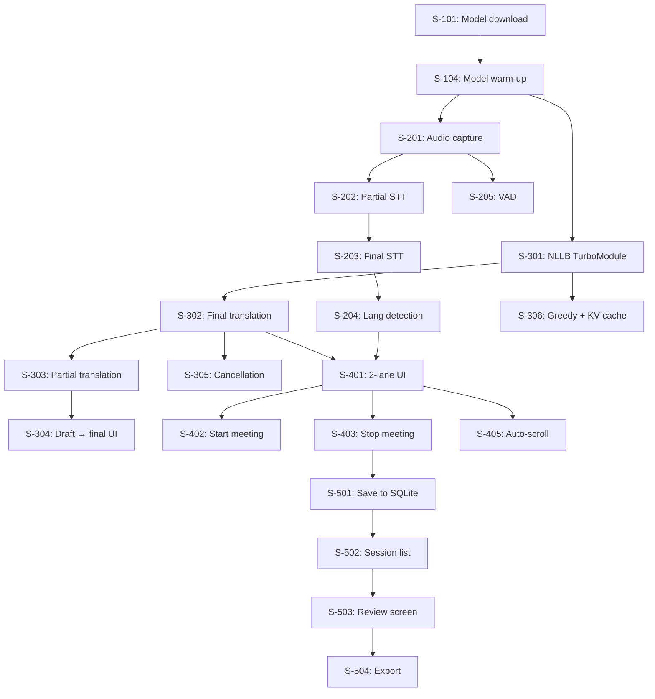

# Epics & User Stories — Meeting Voice Assistant

**Author:** nghinh  
**Date:** 2026-04-13  
**Version:** 3.0 (Offline-Only)  
**Status:** Approved

---

## Overview

6 epics decomposed into 28 user stories, ordered by implementation dependency. MVP delivers Epics 1-4 (core meeting flow). Epics 5-6 are post-MVP polish.

**Milestone mapping:**

| Phase | Epics | Timeline | Deliverable |
|-------|-------|----------|-------------|
| Foundation | E1 (Models), E2 (STT) | Week 1-2 | Models load + STT works on device |
| Core Translation | E3 (Translation) | Week 3-4 | On-device translation working |
| Meeting Flow | E4 (Meeting UI) | Week 5-6 | Full meeting screen with 2 lanes |
| Polish | E5 (Sessions), E6 (Settings) | Week 7 | Persistence, export, settings |

---

## Epic 1: Model Management

**Goal:** Download, cache, and warm up AI models on first launch so all inference runs offline.

| ID | Story | Priority | Points |
|----|-------|----------|--------|
| S-101 | As a first-time user, I want to see a clear download screen showing STT model (234MB) and Translation model (800MB) progress so I know what's being installed. | Must | 5 |
| S-102 | As a user, I want models to be cached locally so subsequent app launches don't re-download. | Must | 3 |
| S-103 | As a user, I want model downloads to resume from where they stopped if interrupted (network drop, app kill). | Should | 5 |
| S-104 | As a developer, I want both models to warm up (run dummy inference) during splash screen so first real use has no cold-start penalty. | Must | 3 |
| S-105 | As a user, I want to see model storage usage in Settings and be able to delete models to free space. | Should | 3 |

**Acceptance criteria for S-101:**
- Given first launch with internet available
- When app opens
- Then download screen shows: model name, size, progress bar per model, total progress
- And STT model downloads first, then Translation model
- And after both complete, app navigates to microphone permission request
- And if download fails, retry button appears per model

**Technical notes:**
- Host ONNX model files on internal server or HuggingFace
- Store in app's internal storage (not external/SD card for security)
- Verify file integrity via SHA-256 checksum after download

---

## Epic 2: On-Device Speech-to-Text

**Goal:** Capture room audio and transcribe EN/JA/KO speech in real time on-device.

| ID | Story | Priority | Points |
|----|-------|----------|--------|
| S-201 | As a user in a meeting, I want the app to capture room audio from the device microphone continuously at 16kHz while the meeting session is active. | Must | 3 |
| S-202 | As a user, I want to see partial (in-progress) transcription text updating in real time as someone speaks, so I can follow the conversation. | Must | 5 |
| S-203 | As a user, I want to see the finalized transcription when the speaker finishes a sentence (silence > 600ms), clearly distinguished from partial text. | Must | 3 |
| S-204 | As a user, I want each transcribed utterance to show which language was detected (EN/JA/KO badge) so I know which language is being spoken. | Must | 2 |
| S-205 | As a user, I want VAD to filter out silence and background noise so I don't see false transcriptions when nobody is talking. | Must | 3 |

**Acceptance criteria for S-202:**
- Given meeting is active and SenseVoice model is loaded
- When a speaker says "The quarterly report shows growth"
- Then partial text appears in the Transcript Lane within 300ms of speech onset
- And text updates progressively as more words are recognized
- And audio data never crosses the React Native JS bridge (stays in native C++ layer)

**Technical notes:**
- Use `react-native-sherpa-onnx` package — DO NOT write custom native STT code
- Model: SenseVoice-Small int8, auto-detect EN/JA/KO
- Audio pipeline: Mic → PCM 16kHz → Silero VAD → SenseVoice → text events to JS

---

## Epic 3: On-Device Translation

**Goal:** Translate STT output to Vietnamese on-device using NLLB-600M, with zero network dependency.

| ID | Story | Priority | Points |
|----|-------|----------|--------|
| S-301 | As a developer, I want a React Native TurboModule (`NllbTranslatorModule`) that wraps ONNX Runtime Mobile for NLLB-600M inference on both Android and iOS. | Must | 13 |
| S-302 | As a user, I want each finalized transcript to be automatically translated to Vietnamese and displayed in the Translation Lane. | Must | 5 |
| S-303 | As a user, I want partial translations (when partial STT has ≥5 words) to appear as "drafts" so I get early translation while the speaker is still talking. | Should | 5 |
| S-304 | As a user, I want the draft translation to be smoothly replaced by the final translation when the speaker finishes, without layout jumps. | Should | 3 |
| S-305 | As a developer, I want translation to be cancellable so that if a new STT result arrives while translation is in progress, the old one is cancelled and replaced. | Must | 3 |
| S-306 | As a developer, I want greedy decoding (argmax) with KV cache via split decoder (no-cache + with-past ONNX files) for fastest on-device inference. | Must | 5 |

**Acceptance criteria for S-301:**
- Given NLLB ONNX models are in local storage
- When JS calls `NllbTranslator.translate("Hello world", "eng_Latn", "vie_Latn")`
- Then returns Vietnamese translation string within 2 seconds on flagship device
- And inference runs on background thread (never blocks UI)
- And supports Android (NNAPI EP) and iOS (CoreML EP) hardware acceleration

**Acceptance criteria for S-302:**
- Given STT emits final result "The quarterly report shows 15% growth" with lang="en"
- When translation is triggered
- Then "Báo cáo quý cho thấy tăng trưởng 15%" appears in Translation Lane
- And translation latency is ≤2 seconds on flagship device
- And translation quality BLEU ≥ 20 on FLORES-200 EN→VI

**Technical notes for S-301 (most complex story):**

Android implementation:
```
NllbTranslatorModule.kt      — TurboModule entry, expose initialize() + translate()
NllbTranslatorHelper.kt      — Load 3 ONNX sessions (encoder, decoder, decoder_with_past)
SentencePieceTokenizer.kt    — Pure Kotlin BPE encode/decode (reference: InstantVoiceTranslate)
```

iOS implementation:
```
NllbTranslatorModule.swift   — TurboModule entry
NllbTranslatorHelper.swift   — ONNX Runtime with CoreML EP
SentencePieceTokenizer.swift — Pure Swift BPE encode/decode
NllbTranslatorModule.mm      — ObjC++ bridge for registration
```

ONNX model files (3 separate files to avoid If-node crash):
- `encoder_model_quantized.onnx` — run once per sentence
- `decoder_model_quantized.onnx` — run for first token (no KV cache input)
- `decoder_with_past_model_quantized.onnx` — run for subsequent tokens (with KV cache)

---

## Epic 4: Meeting Screen UI

**Goal:** Build the core 2-lane meeting screen that displays transcript + translation in real time.

| ID | Story | Priority | Points |
|----|-------|----------|--------|
| S-401 | As a user, I want a meeting screen with two vertically stacked lanes — Transcript (blue accent) and Translation (amber accent) — each independently scrollable. | Must | 5 |
| S-402 | As a user, I want a "Start Meeting" button on the home screen that begins audio capture, STT, and translation when tapped. | Must | 3 |
| S-403 | As a user, I want a "Stop Meeting" button that ends the session and saves all data locally. | Must | 3 |
| S-404 | As a user, I want a recording indicator (pulsing red dot + elapsed timer) at the top of the meeting screen so I know it's actively listening. | Must | 2 |
| S-405 | As a user, I want both lanes to auto-scroll to the latest entry, with a "Jump to latest" button if I scroll up to review history. | Must | 3 |
| S-406 | As a user, I want a waiting state when the meeting starts but before anyone speaks, showing a subtle "Listening..." animation. | Should | 2 |

**Acceptance criteria for S-401:**
- Given meeting is active
- When speaker says a sentence in Japanese
- Then Japanese text with "JA" badge appears in Transcript Lane
- And Vietnamese translation appears in Translation Lane within 2s
- And both lanes scroll independently (scrolling one doesn't affect the other)
- And UI maintains 60fps during active transcription

---

## Epic 5: Session Persistence & History

**Goal:** Save meetings locally and allow review/export after the fact.

| ID | Story | Priority | Points |
|----|-------|----------|--------|
| S-501 | As a user, I want each meeting session (transcript + translations + timestamps) automatically saved to local SQLite database when I stop the meeting. | Must | 5 |
| S-502 | As a user, I want to see a list of past sessions on the home screen with date, duration, detected languages, and utterance count. | Must | 3 |
| S-503 | As a user, I want to tap a past session and see the full transcript with translations in a unified timeline view. | Must | 3 |
| S-504 | As a user, I want to export a meeting transcript as a .txt file containing timestamps, original text, and Vietnamese translations. | Should | 3 |
| S-505 | As a user, I want to delete individual sessions or all session data. | Must | 2 |

**Acceptance criteria for S-504:**
- Given a completed session with 20 utterances
- When user taps "Export" on the Review screen
- Then a `.txt` file is generated with format: `[HH:MM:SS] [LANG] Original text\n→ Vietnamese translation\n\n`
- And system share sheet opens for saving/sending the file

---

## Epic 6: Settings & Polish

**Goal:** User preferences, model management UI, and final polish.

| ID | Story | Priority | Points |
|----|-------|----------|--------|
| S-601 | As a user, I want a Settings screen where I can see model storage usage and model readiness status. | Should | 2 |
| S-602 | As a user, I want to select my preferred target translation language (default Vietnamese) for future expansion. | Could | 2 |
| S-603 | As a developer, I want a dev mode toggle that shows real-time metrics (STT latency, translation latency, RAM usage) overlaid on the meeting screen. | Could | 3 |
| S-604 | As a user, I want the app to work in both light and dark mode, respecting system preference. | Should | 3 |

---

## Story Dependency Graph



---

## Velocity & Sprint Planning

**Estimated total:** 28 stories, ~115 story points

| Sprint (1 week) | Stories | Points | Goal |
|-----------------|---------|--------|------|
| Sprint 1 | S-101, S-102, S-104, S-201, S-205 | 17 | Models load, audio captured, VAD works |
| Sprint 2 | S-202, S-203, S-204, S-301 | 23 | STT streaming works, NLLB module built (Android) |
| Sprint 3 | S-306, S-302, S-305, S-301 (iOS) | 16 | Translation works on both platforms |
| Sprint 4 | S-401, S-402, S-403, S-404 | 13 | Meeting screen functional end-to-end |
| Sprint 5 | S-303, S-304, S-405, S-406 | 13 | Partial translation, draft UI, scroll behavior |
| Sprint 6 | S-501, S-502, S-503, S-505 | 13 | Session persistence + history |
| Sprint 7 | S-103, S-105, S-504, S-601, S-604 | 16 | Export, settings, polish, dark mode |

**Critical path:** S-101 → S-104 → S-301 → S-302 → S-401 → S-501

The longest pole is **S-301 (NLLB TurboModule)** at 13 points — this is the only new native module and requires implementation on both Android and iOS with ONNX Runtime, SentencePiece tokenizer, and split decoder architecture.
