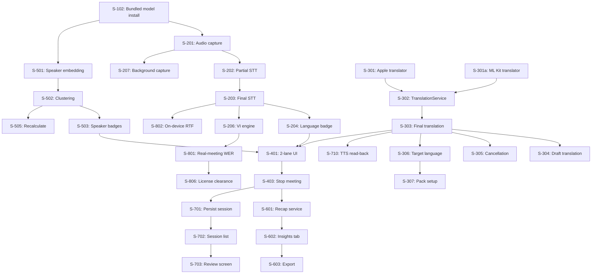

# Epics & User Stories — Meeting Voice Assistant

**Author:** nghinh
**Date:** 2026-08-17
**Version:** 5.0 (Reconciled with implementation)
**Status:** Approved — status column reflects the code at commit `9a6ecf1`
**Change from v4.0:** Epics 1-7 re-scoped to what was actually built; Epic 8 (validation) and Epic 9 (technical debt) added; Opus-MT, Whisper, SQLite, and TF-IDF stories retired.

---

## Overview

Nine epics. Epics 1-7 describe the delivered product; Epics 8-9 describe the work
standing between the current build and a release-ready one.

**Status legend:** ✅ Done · 🟡 Partial · ⬜ Not started · ❌ Retired (decision reversed)

| Epic | Theme | Stories | Status |
|------|-------|---------|--------|
| E1 | Foundation & bundled models | 4 | ✅ |
| E2 | On-device STT | 7 (+1 retired) | ✅ |
| E3 | Platform-native translation | 8 (+1 retired) | ✅ |
| E4 | Meeting UI | 7 | ✅ |
| E5 | Speaker diarization | 6 | 🟡 |
| E6 | Meeting recap & export | 5 | 🟡 |
| E7 | Sessions, settings & polish | 12 | 🟡 |
| E8 | Validation & performance gate | 6 | ⬜ |
| E9 | Technical debt | 5 | ⬜ |

---

## Epic 1: Foundation & Bundled Models ✅

**Goal:** Ship the STT and diarization models with the app and have them ready before the user can start a meeting.

| ID | Story | Priority | Status |
|----|-------|----------|--------|
| S-101 | As a user, I want a splash screen showing setup progress so I know the app is preparing. | Must | ✅ |
| S-102 | As a developer, I want bundled model files copied out of the app bundle into the app directory on first launch, excluded from iCloud backup on iOS. | Must | ✅ |
| S-103 | As a developer, I want the build to fetch missing model archives automatically so a fresh clone can build without manual asset steps. | Must | ✅ |
| S-104 | As a user, I want an actionable message when model assets are missing or the install fails, instead of a blank screen. | Must | ✅ |

**Notes:**
- Model binaries are gitignored; `mobile/scripts/copy-required-model-assets.js` downloads them from the sherpa-onnx releases and is wired into the Xcode build phase.
- Speaker-embedding initialization is deliberately non-fatal — the meeting flow works without speaker labels.

---

## Epic 2: On-Device Speech-to-Text ✅

**Goal:** Capture meeting audio and transcribe it on the device, in the meeting's language.

| ID | Story | Priority | Status |
|----|-------|----------|--------|
| S-201 | As a user, I want continuous 16kHz audio capture while a session is active. | Must | ✅ |
| S-202 | As a user, I want partial transcript text updating while someone is speaking. | Must | ✅ |
| S-203 | As a user, I want a finalized transcript when the speaker stops, clearly distinct from partial text. | Must | ✅ |
| S-204 | As a user, I want each utterance labeled with its detected language. | Must | ✅ |
| S-205 | As a user, I want silence and background noise filtered out so the transcript is not full of noise. | Must | ✅ |
| S-206 | As a Vietnamese-speaking user, I want to select Vietnamese input and get a dedicated engine instead of broken auto-detect output. | Must | ✅ |
| S-207 | As a user, I want capture to survive screen lock, app backgrounding, and phone-call interruptions. | Must | ✅ |
| S-208 | ~~Whisper-Small int8 for all five languages~~ | — | ❌ Retired — see ADR-002 |

**Technical notes:**
- Auto mode: SenseVoice-Small int8 with ITN, covering EN/JA/KO/ZH.
- Vietnamese mode: Zipformer-VI int8 offline transducer, every event pinned to `vi`.
- Detection is energy-based with hysteresis, an adaptive noise floor, and 400ms pre-roll — not Silero VAD. Thresholds are platform-specific (see `architecture.md` §2.2).
- Background capture: Android foreground service of type `microphone`; iOS `UIBackgroundModes: audio`.

---

## Epic 3: Platform-Native Translation ✅

**Goal:** Translate transcripts on-device with no meeting-time network.

| ID | Story | Priority | Status |
|----|-------|----------|--------|
| S-301 | As a developer (iOS), I want a native module wrapping Apple Translation Framework. | Must | ✅ |
| S-301a | As a developer (Android), I want a native module wrapping Google ML Kit Translate. | Must | ✅ |
| S-302 | As a developer, I want one `TranslationService` API so JS never branches on platform. | Must | ✅ |
| S-303 | As a user, I want each finalized transcript translated and shown in the Translation lane. | Must | ✅ |
| S-304 | As a user, I want partial results translated as visibly-marked drafts. | Should | ✅ |
| S-305 | As a developer, I want an in-flight translation cancelled when a newer STT revision arrives. | Must | ✅ |
| S-306 | As a user, I want to choose my target language, not have Vietnamese forced. | Must | ✅ |
| S-307 | As a user, I want to download translation packs during setup and be warned before starting a meeting whose pair is missing. | Must | ✅ |
| S-308 | ~~Bundled Opus-MT with EN-pivot two-hop on Android~~ | — | ❌ Retired — see ADR-003 |

**Acceptance criteria — S-306:**
- Source ∈ {en, ja, ko, zh, vi}, target ∈ {en, vi, zh, ko, ja}, default `vi`.
- When source equals target the text passes through with no translation call.

**Acceptance criteria — S-307:**
- Pack status is shown per pair in Settings, with download and delete controls.
- Starting a meeting with a missing pair prompts: go back, or continue without translation.

---

## Epic 4: Meeting UI ✅

**Goal:** A meeting screen an executive can read at a glance.

| ID | Story | Priority | Status |
|----|-------|----------|--------|
| S-401 | As a user, I want two lanes — Transcript and Translation — with a split/single toggle. | Must | ✅ |
| S-402 | As a user, I want a Start control that begins capture, STT, and translation. | Must | ✅ |
| S-403 | As a user, I want a Stop control that ends the session, generates the recap, and saves everything. | Must | ✅ |
| S-404 | As a user, I want a recording indicator and elapsed timer. | Must | ✅ |
| S-405 | As a user, I want auto-scroll with a jump-to-latest affordance. | Must | ✅ |
| S-406 | As a user, I want a clear waiting state before the first speech is detected. | Should | ✅ |
| S-407 | As a user, I want readiness problems surfaced before I press Start — model not ready, prewarm pending, translator unavailable, pack missing — each with an action. | Must | ✅ |

---

## Epic 5: Speaker Diarization 🟡

**Goal:** Attribute each utterance to an anonymous speaker.

| ID | Story | Priority | Status |
|----|-------|----------|--------|
| S-501 | As a developer, I want a 192-dim CAM++ embedding extracted per utterance on both platforms. | Should | ✅ |
| S-502 | As a developer, I want a clustering service with three-zone cosine thresholds, temporal bias, auto-merge, and a speaker cap. | Should | ✅ |
| S-503 | As a user, I want colored speaker badges in both lanes and a speaker count on session cards. | Should | ✅ |
| S-504 | As a user, I want diarization to be non-blocking — a failure must not affect the transcript. | Must | ✅ |
| S-505 | As a user, I want a "Recalculate Speakers" action on the Review screen. | Should | ✅ |
| S-506 | As a developer, I want a real segmentation model driving utterance boundaries instead of the placeholder. | Should | ⬜ |

**Technical notes:**
- Defaults: similarity 0.50, high-confidence 0.65, new-cluster gate 0.22, minimum utterance 1.0s, temporal window 10.0s.
- Sensitivity is user-adjustable 0.3–0.9; the full parameter set is exposed under Developer mode.
- The offline diarization pass is throttled to once per 8s over at most 6s of audio.
- Works best with 2-4 speakers; degrades above ~6.

---

## Epic 6: Meeting Recap & Export 🟡

**Goal:** Turn a finished session into something worth reading afterwards.

| ID | Story | Priority | Status |
|----|-------|----------|--------|
| S-601 | As a developer, I want a deterministic recap service where every highlight names the rule that selected it. | Should | ✅ |
| S-602 | As a user, I want recap, key moments, and speaker/language statistics on the Review screen. | Should | ✅ |
| S-603 | As a user, I want to export the transcript, the recap, or full minutes as Markdown via the share sheet. | Should | ✅ |
| S-604 | As a user, I want action items detected across languages. | Should | ⬜ |
| S-605 | As a user, I want the meeting split into topic segments. | Should | ⬜ |

**Technical notes:**
- Rules in use: longest utterances, closing utterances, repeated keywords, speaker balance, language split.
- No AI, no LLM, no cloud. Runs over data already in local storage.
- The v4.0 TF-IDF/`SentenceScorer` design was not built; S-604 and S-605 are what remains of it.

---

## Epic 7: Sessions, Settings & Polish 🟡

**Goal:** Keep meetings, let the user tune the app, and make it presentable.

| ID | Story | Priority | Status |
|----|-------|----------|--------|
| S-701 | As a user, I want sessions, utterances, translations, and speaker labels saved when a meeting stops. | Must | ✅ |
| S-702 | As a user, I want a session list with date, duration, languages, and speaker count. | Must | ✅ |
| S-703 | As a user, I want a Review screen with Transcript, Insights, Media, and Export tabs. | Must | ✅ |
| S-704 | As a user, I want to delete one session or all of them, and see how much local storage they use. | Must | ✅ |
| S-705 | As a user, I want Settings to show which engines and models are in use and their state. | Should | ✅ |
| S-706 | As a user, I want a diarization sensitivity slider. | Should | ✅ |
| S-707 | As a developer, I want a metrics overlay and clustering-parameter tuning behind a deliberate unlock. | Could | ✅ |
| S-708 | As a user, I want light and dark themes following the system preference, with a manual override. | Should | ✅ |
| S-709 | As a user, I want the app interface in my own language (VI/EN/JA/KO/ZH). | Should | ✅ |
| S-710 | As a user, I want optional spoken read-back of the translation lane, with a rate control and an Android voice-pack check. | Should | ✅ |
| S-711 | As a user, I want my data stored encrypted at rest with a device-bound key. | Must | ✅ |
| S-712 | As a developer, I want storage migrated to SQLite so long meetings do not rewrite whole collections. | Should | ⬜ |

---

## Epic 8: Validation & Performance Gate ⬜

**Goal:** Replace target numbers with measured ones. Nothing in this epic is started, and no release commitment should be made until it is.

| ID | Story | Priority | Status |
|----|-------|----------|--------|
| S-801 | As a stakeholder, I want WER measured on consented real meeting audio, not only on FLEURS read speech — the formal go/no-go gate. | Must | ⬜ |
| S-802 | As a developer, I want on-device RTF for both STT engines on an iPhone and on the lowest-end supported Android handset. | Must | ⬜ |
| S-803 | As a developer, I want end-to-end latency measured from end-of-speech to translation displayed. | Must | ⬜ |
| S-804 | As a developer, I want peak RAM measured with all engines loaded, on both platforms. | Must | ⬜ |
| S-805 | As a developer, I want battery drain per meeting hour measured with the screen on and locked. | Should | ⬜ |
| S-806 | As a stakeholder, I want legal confirmation of the Zipformer-VI training-data license before release. | Must | ⬜ |

**Notes:**
- The harness for S-801 already exists: `bench/run_bench.py run --model all --dataset meeting --meeting-dir <dir>`.
- S-802 needs a small in-app developer screen calling `transcribeSamples` with 5/10/15s buffers.
- A low-end Android reference device still has to be nominated.

---

## Epic 9: Technical Debt ⬜

**Goal:** Remove the traps a new contributor would otherwise fall into.

| ID | Story | Priority | Status |
|----|-------|----------|--------|
| S-901 | Remove `src/native/model_manager/` — a download interface with a mock implementation that nothing calls. | Should | ⬜ |
| S-902 | Consolidate the two STT pipelines: `MeetingPipeline` (simulator, used by tests) versus `RealSpeechRecognizer` (shipped). | Should | ⬜ |
| S-903 | Replace `console.warn` diagnostics in the persistence layer with the shared logger, so meeting content cannot leak into device logs. | Must | ⬜ |
| S-904 | Raise test coverage — 9 test files cover a codebase whose orchestrator alone is ~1,400 lines. | Should | ⬜ |
| S-905 | Update `docs/planning-artifacts/ux-design-specification.md`, which still describes the v4.0 product. | Should | ⬜ |

---

## Dependency Graph

```mermaid
graph TD
    S102[S-102: Bundled model install] --> S201[S-201: Audio capture]
    S102 --> S501[S-501: Speaker embedding]
    S201 --> S202[S-202: Partial STT]
    S202 --> S203[S-203: Final STT]
    S203 --> S204[S-204: Language badge]
    S203 --> S206[S-206: VI engine]
    S201 --> S207[S-207: Background capture]

    S301[S-301: Apple translator] --> S302[S-302: TranslationService]
    S301a[S-301a: ML Kit translator] --> S302
    S302 --> S303[S-303: Final translation]
    S303 --> S304[S-304: Draft translation]
    S303 --> S305[S-305: Cancellation]
    S303 --> S306[S-306: Target language]
    S306 --> S307[S-307: Pack setup]
    S303 --> S710[S-710: TTS read-back]

    S501 --> S502[S-502: Clustering]
    S502 --> S503[S-503: Speaker badges]
    S502 --> S505[S-505: Recalculate]

    S204 --> S401[S-401: 2-lane UI]
    S303 --> S401
    S503 --> S401
    S401 --> S403[S-403: Stop meeting]
    S403 --> S601[S-601: Recap service]
    S601 --> S602[S-602: Insights tab]
    S602 --> S603[S-603: Export]
    S403 --> S701[S-701: Persist session]
    S701 --> S702[S-702: Session list]
    S702 --> S703[S-703: Review screen]

    S206 --> S801[S-801: Real-meeting WER]
    S203 --> S802[S-802: On-device RTF]
    S801 --> S806[S-806: License clearance]
```

---

## Where the Work Stands

Epics 1-4 are complete. Epics 5-7 are complete except for four deferred stories
— S-506 (real segmentation model), S-604 (action items), S-605 (topic segments),
and S-712 (SQLite migration). The product is feature-complete enough to demo, and
an iOS release build has been run on physical hardware (see
`mobile/ios/BUILD-TESTFLIGHT.md`).

What separates it from releasable is **Epic 8**: not one performance or accuracy
number in this document has been measured on a phone. The single measurement that
does exist — Vietnamese WER of 10.09% — comes from clean read speech and is
explicitly an optimistic upper bound.
