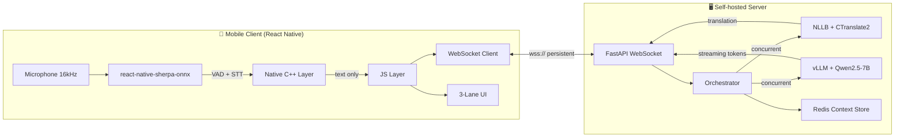
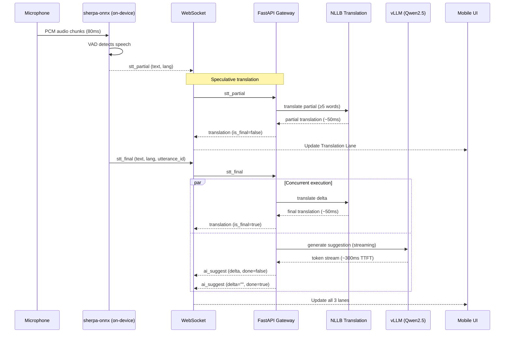
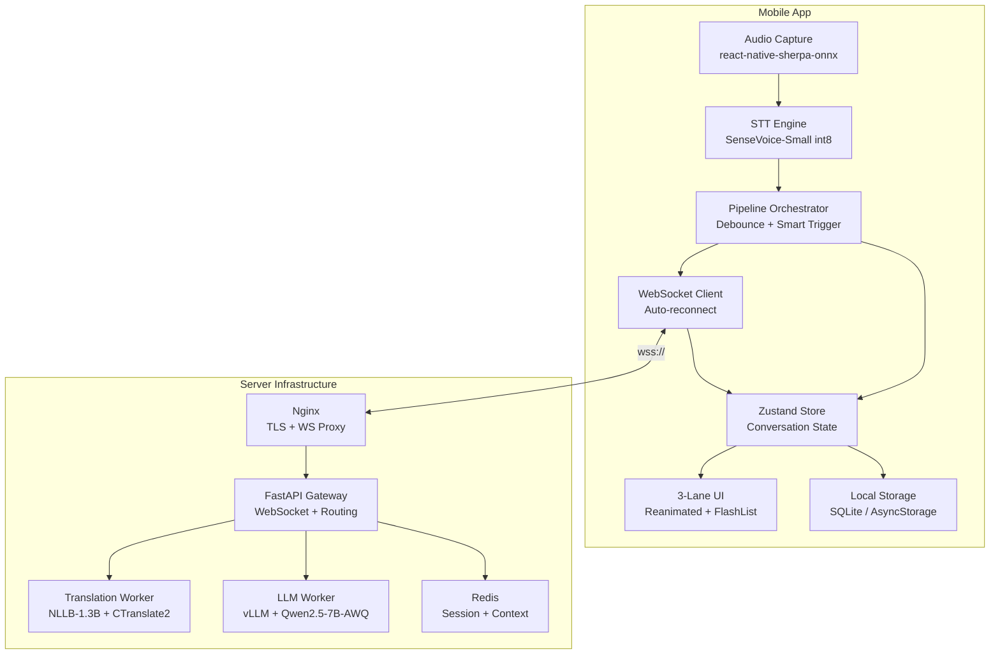

# Meeting Voice Assistant — Project Requirements

**Document Version:** 2.1 FINAL  
**Last Updated:** 2026-04-12  
**Status:** Approved  
**Owner:** VNPT SI / VGS

---

## Table of Contents

1. [Project Overview](#1-project-overview)
2. [Functional Requirements](#2-functional-requirements)
3. [Non-Functional Requirements](#3-non-functional-requirements)
4. [Technical Constraints](#4-technical-constraints)
5. [System Architecture Summary](#5-system-architecture-summary)
6. [API Specification](#6-api-specification)
7. [Data Models](#7-data-models)
8. [Deployment Requirements](#8-deployment-requirements)
9. [Testing Requirements](#9-testing-requirements)
10. [Development Milestones](#10-development-milestones)
11. [Risks & Mitigations](#11-risks--mitigations)
12. [Glossary](#12-glossary)

---

## 1. Project Overview

### 1.1 Project Name

**Meeting Voice Assistant (MVA)**

### 1.2 Objective

Build a mobile application that enables Vietnamese-speaking executives to participate effectively in multilingual meetings by providing real-time speech recognition, Vietnamese translation, and AI-powered response suggestions — all running on a fully self-hosted infrastructure with no third-party cloud dependencies.

### 1.3 Target User

Senior directors and executives at Vietnamese telecom corporations who regularly attend meetings with international partners speaking English, Japanese, or Korean. The user places their personal smartphone on the meeting table; the app captures room audio, displays translated text, and suggests contextually appropriate replies on-screen.

### 1.4 Primary Use Cases

| ID | Use Case | Description |
|----|----------|-------------|
| UC-01 | Live meeting translation | User sits in a meeting room. App captures speaker audio, transcribes in original language, translates to Vietnamese, and displays both in real time. |
| UC-02 | AI response suggestion | After a counterpart finishes speaking, the app suggests 1–2 reply options in Vietnamese (with optional English version) based on conversation context and user's professional role. |
| UC-03 | Offline transcription | When the server is unreachable (e.g., during travel), the app continues to transcribe speech on-device without translation or AI suggestions. |
| UC-04 | Meeting review | After a meeting, the user scrolls through the full conversation history with original text, translations, and any AI suggestions generated during the session. |

---

## 2. Functional Requirements

### 2.1 Audio Capture

| ID | Title | Priority | Description |
|----|-------|----------|-------------|
| FR-001 | Microphone audio capture | Must | The app shall capture audio from the device microphone at 16 kHz sample rate, mono channel, 16-bit PCM. Audio capture runs entirely in the native layer via `react-native-sherpa-onnx` PCM live stream. |
| FR-002 | Continuous background capture | Must | Audio capture shall continue uninterrupted while the app is in foreground, even when the user scrolls the conversation history or changes settings. |
| FR-003 | Audio chunk streaming | Must | Audio shall be processed in 80 ms chunks (1,280 samples at 16 kHz) and fed directly to the on-device VAD/STT pipeline without crossing the React Native JS bridge. |

**Acceptance Criteria (FR-001):**
- **Given** the user taps "Start Meeting" and grants microphone permission,
- **When** ambient speech is present in the room,
- **Then** the app captures PCM audio at 16 kHz mono and feeds it to the STT engine within 80 ms per chunk, with no audio data serialized through the React Native bridge.

### 2.2 Speech-to-Text (STT) Streaming

| ID | Title | Priority | Description |
|----|-------|----------|-------------|
| FR-010 | On-device streaming STT | Must | The app shall perform streaming speech-to-text on-device using `react-native-sherpa-onnx` with the SenseVoice-Small int8 model. STT runs in the native C++ layer. |
| FR-011 | Partial result emission | Must | The STT engine shall emit partial (intermediate) transcription results approximately every 300 ms while speech is ongoing. |
| FR-012 | Final result emission | Must | When VAD detects end-of-utterance (silence > 600 ms), the STT engine shall emit a final transcription result for the completed utterance. |
| FR-013 | Voice Activity Detection | Must | The app shall use Silero VAD (bundled with sherpa-onnx) to detect speech onset and offset. VAD processes 32 ms chunks. Only speech segments are forwarded to the STT decoder. |
| FR-014 | Multi-speaker handling | Should | The STT engine shall transcribe speech from multiple speakers in the room without requiring speaker registration. Speaker diarization is not required for v1. |

**Acceptance Criteria (FR-010):**
- **Given** the SenseVoice-Small int8 model is loaded on the device,
- **When** a meeting participant speaks in English, Japanese, or Korean,
- **Then** the app produces a text transcription with Word Error Rate (WER) ≤ 15% for clear speech in a quiet meeting room environment, with partial results appearing within 300 ms of speech onset.

### 2.3 Language Detection

| ID | Title | Priority | Description |
|----|-------|----------|-------------|
| FR-020 | Automatic language detection | Must | The STT engine (SenseVoice) shall automatically detect the source language of each utterance from the set {English, Japanese, Korean} and include the detected language code in both partial and final results. |
| FR-021 | Language indicator UI | Must | The UI shall display a language badge (EN / JA / KO) next to each transcribed utterance, updated in real time as detection occurs. |
| FR-022 | Manual language override | Could | The user may manually set the expected source language in settings to improve STT accuracy in noisy environments. |

**Acceptance Criteria (FR-020):**
- **Given** a speaker is talking in Japanese,
- **When** the STT engine emits a partial or final result,
- **Then** the result includes `lang: "ja"` with detection accuracy ≥ 95% for utterances of 3 or more words.

### 2.4 Translation

| ID | Title | Priority | Description |
|----|-------|----------|-------------|
| FR-030 | Real-time translation to Vietnamese | Must | Each STT result (partial or final) shall be sent to the self-hosted translation server and translated from the detected source language to Vietnamese. |
| FR-031 | Speculative translation | Must | When a partial STT result reaches ≥ 5 words, the app shall send it for translation immediately without waiting for the final result. When the final result arrives, only the delta (new/changed portion) is translated and merged with the earlier partial translation. |
| FR-032 | Translation display | Must | Translated text shall appear in the Translation Lane of the 3-lane UI. Partial translations are shown with a visual indicator (e.g., lighter opacity) and replaced by final translations seamlessly. |
| FR-033 | Translation for all supported languages | Must | Translation shall support: English → Vietnamese, Japanese → Vietnamese, Korean → Vietnamese. NLLB language codes: `eng_Latn`, `jpn_Jpan`, `kor_Hang` → `vie_Latn`. |

**Acceptance Criteria (FR-031):**
- **Given** a speaker is mid-sentence and the STT partial result contains "The quarterly report shows",
- **When** the partial reaches 5 words,
- **Then** a speculative translation request is sent to the server, and a partial Vietnamese translation appears in the Translation Lane within 200 ms of the partial STT emission.

### 2.5 AI Response Suggestion

| ID | Title | Priority | Description |
|----|-------|----------|-------------|
| FR-040 | AI-powered reply suggestion | Must | After a final STT result is produced, the app shall request an AI-generated response suggestion from the self-hosted LLM, streamed token-by-token to the Suggest Lane. |
| FR-041 | Context-aware suggestions | Must | The LLM receives the last 5 conversation turns (original text + language) plus a fixed system prompt describing the user's professional role. Suggestions are generated in Vietnamese with an optional English version when the meeting language is English. |
| FR-042 | Streaming display | Must | AI suggestion tokens shall stream to the UI as they are generated, so the user sees text appearing progressively. |
| FR-043 | Smart AI trigger | Must | AI suggestions shall only be triggered when all of the following conditions are met: (a) the utterance contains ≥ 8 words, (b) the cooldown period of 5 seconds since the last suggestion has elapsed. Question-like utterances (containing `?`, `か`, `까`) shall be prioritized. |
| FR-044 | Manual trigger mode | Should | The user may switch to manual mode where AI suggestions are generated only when the user taps a "Suggest" button. |
| FR-045 | Copy suggestion to clipboard | Must | The user can tap on an AI suggestion to copy it to the device clipboard for pasting into a chat or note-taking app. |

**Acceptance Criteria (FR-040):**
- **Given** a meeting participant finishes a sentence of 10+ words,
- **When** the final STT result is emitted and the smart trigger conditions are met,
- **Then** an AI suggestion begins streaming in the Suggest Lane within 1.5 seconds of end-of-speech, with the complete suggestion (≤ 150 tokens) fully rendered within 3 seconds.

### 2.6 User Interface

| ID | Title | Priority | Description |
|----|-------|----------|-------------|
| FR-050 | Three-lane layout | Must | The main meeting screen shall display three vertically stacked, independently scrollable lanes: (1) Original Transcript Lane — streaming STT text with language badge, (2) Translation Lane — Vietnamese translation, (3) Suggest Lane — AI response suggestions with copy button. |
| FR-051 | Auto-scroll with manual override | Must | Each lane auto-scrolls to the latest entry. When the user manually scrolls up to review history, auto-scroll pauses until the user taps a "Jump to latest" button. |
| FR-052 | Meeting session controls | Must | The screen shall include: Start/Stop Meeting button, AI suggest toggle (on/off/manual), connection status indicator (server connected/disconnected/reconnecting). |
| FR-053 | Latency monitor (dev mode) | Could | In developer mode, the UI shall display real-time latency metrics: STT latency, translation latency, AI TTFT, total end-to-end latency. |

**Acceptance Criteria (FR-050):**
- **Given** the meeting is active and a speaker says a sentence,
- **When** the STT produces text, translation arrives, and AI suggestion streams in,
- **Then** all three lanes update independently and concurrently without blocking each other, maintaining 60 fps rendering with no visible jank.

### 2.7 Conversation History

| ID | Title | Priority | Description |
|----|-------|----------|-------------|
| FR-060 | Session persistence | Must | Each meeting session's conversation history (original text, translations, AI suggestions, timestamps) shall be persisted locally on the device using SQLite or AsyncStorage. |
| FR-061 | Session list | Should | The app shall display a list of past meeting sessions with date, duration, and language breakdown. |
| FR-062 | Export transcript | Could | The user may export a meeting transcript as a text file containing timestamps, original text, and Vietnamese translations. |

### 2.8 Settings & Configuration

| ID | Title | Priority | Description |
|----|-------|----------|-------------|
| FR-070 | Server URL configuration | Must | The user shall configure the WebSocket server URL (e.g., `wss://meeting-server.local:443/ws`). |
| FR-071 | AI suggest mode | Must | Settings shall allow choosing AI suggest mode: Auto, Question-only, Manual, or Off. |
| FR-072 | Target language | Should | Settings shall allow selecting the target translation language (default: Vietnamese). Future expansion to other target languages. |
| FR-073 | STT model selection | Could | Settings shall allow choosing between different STT models (SenseVoice-Small, Whisper-Small) if multiple are downloaded. |

### 2.9 Model Download & Management

| ID | Title | Priority | Description |
|----|-------|----------|-------------|
| FR-080 | First-launch model download | Must | On first launch, the app shall download the SenseVoice-Small int8 model (~234 MB) with a progress indicator. The model is cached locally for subsequent launches. |
| FR-081 | Model storage management | Should | The app shall display model storage usage and allow the user to delete cached models to free device storage. |
| FR-082 | Model pre-warming | Must | After the model is loaded into memory (during splash screen), the app shall run one dummy inference pass to warm up the ONNX runtime, eliminating the cold-start penalty on the first real utterance. |

**Acceptance Criteria (FR-082):**
- **Given** the app is launched and the splash screen is displayed,
- **When** the SenseVoice model finishes loading,
- **Then** a dummy inference is executed, and the first real utterance receives STT results with the same latency as subsequent utterances (no > 200 ms additional delay).

---

## 3. Non-Functional Requirements

### 3.1 Latency Targets

| ID | Metric | Target | Maximum | Measured From |
|----|--------|--------|---------|---------------|
| NFR-001 | Audio chunk to STT | 80 ms | 100 ms | Mic capture to chunk available |
| NFR-002 | VAD decision | 30 ms | 50 ms | Chunk received to speech/silence verdict |
| NFR-003 | STT partial result | 200 ms | 400 ms | Speech onset to first partial text |
| NFR-004 | STT final result | 200 ms | 400 ms | End-of-speech to final text |
| NFR-005 | WebSocket round-trip (LAN) | 2 ms | 5 ms | Client send to server receive |
| NFR-006 | Translation (NLLB) | 30 ms | 80 ms | Server receives text to translation complete |
| NFR-007 | AI suggest TTFT | 300 ms | 500 ms | Server receives text to first LLM token |
| NFR-008 | AI suggest complete | 600 ms | 1,200 ms | First token to last token (150 tokens) |
| NFR-009 | End-to-end translation | 345 ms | 800 ms | End-of-speech to translation displayed |
| NFR-010 | End-to-end AI suggest | 950 ms | 1,800 ms | End-of-speech to first AI token displayed |
| NFR-011 | Speculative partial translation | 150 ms | 250 ms | Partial STT to partial translation displayed |

### 3.2 Performance

| ID | Metric | Requirement |
|----|--------|-------------|
| NFR-020 | UI frame rate | ≥ 60 fps during active transcription and streaming |
| NFR-021 | Memory usage (mobile) | ≤ 600 MB RAM including STT model |
| NFR-022 | Battery drain | ≤ 5% per hour of active meeting on flagship device (2024+) |
| NFR-023 | STT Real-Time Factor | ≤ 0.08 on Android flagship, ≤ 0.05 on iPhone 15 Pro |
| NFR-024 | Server GPU utilization | ≤ 85% at peak load (5 concurrent sessions) |

### 3.3 Concurrency

| ID | Metric | Requirement |
|----|--------|-------------|
| NFR-030 | Concurrent WebSocket sessions | 5 (target), up to 20 (maximum) |
| NFR-031 | Translation throughput | ≥ 20 requests/second on single GPU |
| NFR-032 | LLM concurrent requests | ≥ 5 concurrent streaming completions via vLLM |

### 3.4 Availability

| ID | Metric | Requirement |
|----|--------|-------------|
| NFR-040 | Server uptime | ≥ 99.5% during business hours (Mon–Fri, 08:00–18:00 ICT) |
| NFR-041 | WebSocket reconnection | Auto-reconnect within 3 seconds of connection drop, resume session context from Redis |
| NFR-042 | Graceful degradation | If LLM server is overloaded (queue > 5), skip AI suggestions and continue delivering translations without interruption |

### 3.5 Security & Privacy

| ID | Metric | Requirement |
|----|--------|-------------|
| NFR-050 | Data in transit | All WebSocket connections encrypted via TLS 1.3 (wss://) |
| NFR-051 | Data at rest | Conversation history encrypted on device using platform keychain |
| NFR-052 | No third-party data sharing | No audio, text, or meeting content shall be transmitted to any external cloud service. All processing occurs on-device or on the self-hosted server within the organization's network. |
| NFR-053 | Audio storage | Raw audio is NOT stored or transmitted. Only text transcriptions cross the network boundary. Audio remains in the native buffer and is discarded after STT processing. |
| NFR-054 | Session data retention | Server-side Redis session data expires after 24 hours. No permanent storage of meeting content on the server. |

### 3.6 Offline Capability

| ID | Metric | Requirement |
|----|--------|-------------|
| NFR-060 | Offline STT | When the server is unreachable, the app shall continue transcribing speech on-device and display original text in the Transcript Lane. Translation and AI Suggest lanes show "Server offline" status. |
| NFR-061 | Offline session storage | Conversation data collected during offline mode shall be stored locally and optionally synced when the server becomes available. |

---

## 4. Technical Constraints

### 4.1 Fixed Technology Stack

| Layer | Technology | Version/Variant | Notes |
|-------|-----------|-----------------|-------|
| Mobile framework | React Native | 0.76+ (New Architecture) | TurboModules enabled |
| On-device STT | react-native-sherpa-onnx | v0.3.3+ (XDcobra) | TurboModule, NOT custom native code |
| STT model | SenseVoice-Small | int8 quantized (~234 MB) | Auto-detect EN/JA/KO/ZH/YUE |
| State management | Zustand | Latest | Lightweight, no Redux |
| Server gateway | FastAPI | 0.115+ | Python, single service |
| ASGI server | uvicorn | Latest | Workers = CPU core count |
| Translation model | NLLB-200-distilled-1.3B | int8 via CTranslate2 | ~2 GB VRAM |
| Translation engine | CTranslate2 | 4.7+ | int8, beam_size=2 |
| LLM model | Qwen2.5-7B-Instruct-AWQ | int4 quantized | ~6 GB VRAM |
| LLM serving | vLLM | 0.7+ | PagedAttention, prefix caching |
| Session store | Redis | 7+ (Alpine) | TTL 24 hours |
| TLS termination | Nginx | Alpine | WebSocket proxy |
| Containerization | Docker Compose | v2 | Multi-service orchestration |

### 4.2 Explicitly Excluded Technologies

| Technology | Reason for Exclusion |
|-----------|---------------------|
| Google Cloud Speech/Translate API | No third-party cloud services permitted |
| AWS, Azure, or any cloud provider | Self-hosted infrastructure requirement |
| LiveKit / WebRTC | Over-engineering for single-device personal assistant use case |
| Meta SeamlessStreaming | Higher latency (~2s) than current pipeline (~350ms); requires audio streaming to server |
| Custom native modules (Kotlin/Swift) | `react-native-sherpa-onnx` provides complete TurboModule coverage |
| Node.js gateway | FastAPI handles WebSocket natively; additional hop adds latency |
| 9router / Router9 / OpenRouter | Cloud-based LLM routers; use vLLM + LiteLLM for self-hosted routing |

---

## 5. System Architecture Summary

### 5.1 High-Level Architecture



### 5.2 Data Flow — Single Utterance



### 5.3 Component Diagram



---

## 6. API Specification

### 6.1 WebSocket Endpoint

**URL:** `wss://{server_host}:{port}/ws/{session_id}`

Connection is persistent for the duration of a meeting session. The client must include a `session_id` (UUID v4) in the URL path. If a connection drops and the client reconnects with the same `session_id`, the server restores conversation context from Redis.

### 6.2 Client → Server Messages

#### 6.2.1 STT Partial Result

```json
{
  "type": "stt_partial",
  "text": "The quarterly report shows",
  "lang": "en",
  "session_id": "550e8400-e29b-41d4-a716-446655440000",
  "ts": 1713000000000
}
```

| Field | Type | Required | Description |
|-------|------|----------|-------------|
| type | string | Yes | Always `"stt_partial"` |
| text | string | Yes | Current partial transcription |
| lang | string | Yes | Detected language: `"en"`, `"ja"`, `"ko"` |
| session_id | string | Yes | UUID v4 session identifier |
| ts | integer | Yes | Client-side Unix timestamp in milliseconds |

#### 6.2.2 STT Final Result

```json
{
  "type": "stt_final",
  "text": "The quarterly report shows 15% growth in Q3",
  "lang": "en",
  "utterance_id": "utt_20260412_001",
  "session_id": "550e8400-e29b-41d4-a716-446655440000",
  "ts": 1713000001500
}
```

| Field | Type | Required | Description |
|-------|------|----------|-------------|
| type | string | Yes | Always `"stt_final"` |
| text | string | Yes | Complete utterance transcription |
| lang | string | Yes | Detected language |
| utterance_id | string | Yes | Unique identifier for this utterance |
| session_id | string | Yes | Session identifier |
| ts | integer | Yes | Client-side Unix timestamp in milliseconds |

#### 6.2.3 Configuration

```json
{
  "type": "config",
  "ai_suggest": true,
  "ai_mode": "auto",
  "target_lang": "vi"
}
```

| Field | Type | Required | Description |
|-------|------|----------|-------------|
| type | string | Yes | Always `"config"` |
| ai_suggest | boolean | Yes | Enable/disable AI suggestions |
| ai_mode | string | Yes | `"auto"`, `"question_only"`, `"manual"` |
| target_lang | string | Yes | Target translation language code (default: `"vi"`) |

### 6.3 Server → Client Messages

#### 6.3.1 Translation Result

```json
{
  "type": "translation",
  "utterance_id": "utt_20260412_001",
  "text": "Báo cáo quý cho thấy tăng trưởng 15% trong Q3",
  "is_final": true,
  "latency_ms": 45
}
```

| Field | Type | Description |
|-------|------|-------------|
| type | string | Always `"translation"` |
| utterance_id | string | Matches the utterance this translation belongs to |
| text | string | Translated text in target language |
| is_final | boolean | `false` for speculative partial translations, `true` for final |
| latency_ms | integer | Server-side processing time in milliseconds |

#### 6.3.2 AI Suggestion (Streaming)

```json
{
  "type": "ai_suggest",
  "utterance_id": "utt_20260412_001",
  "delta": "Cảm ơn. Con số",
  "done": false
}
```

Final message when generation completes:

```json
{
  "type": "ai_suggest",
  "utterance_id": "utt_20260412_001",
  "delta": "",
  "done": true,
  "full_text": "Cảm ơn. Con số tăng trưởng này phù hợp với kế hoạch Q2 của chúng tôi.",
  "latency_ms": 1150
}
```

| Field | Type | Description |
|-------|------|-------------|
| type | string | Always `"ai_suggest"` |
| utterance_id | string | Matches the triggering utterance |
| delta | string | Incremental text to append (empty string on final) |
| done | boolean | `true` when generation is complete |
| full_text | string | Complete suggestion text (only present when `done=true`) |
| latency_ms | integer | Total generation time (only present when `done=true`) |

#### 6.3.3 System Status

```json
{
  "type": "status",
  "gpu_util": 0.65,
  "llm_queue": 0,
  "translation_avg_ms": 42
}
```

| Field | Type | Description |
|-------|------|-------------|
| type | string | Always `"status"` |
| gpu_util | float | Current GPU utilization (0.0–1.0) |
| llm_queue | integer | Number of pending LLM requests |
| translation_avg_ms | integer | Rolling average translation latency |

---

## 7. Data Models

### 7.1 Session

```
Session {
  id: UUID (primary key)
  created_at: datetime
  ended_at: datetime (nullable)
  server_url: string
  device_info: string
  settings: UserConfig
  status: enum ["active", "ended", "interrupted"]
}
```

### 7.2 Utterance

```
Utterance {
  id: string (e.g., "utt_20260412_001")
  session_id: UUID (foreign key → Session)
  text: string
  lang: enum ["en", "ja", "ko"]
  is_final: boolean
  timestamp: datetime
  stt_latency_ms: integer
}
```

### 7.3 Translation

```
Translation {
  id: UUID (primary key)
  utterance_id: string (foreign key → Utterance)
  text: string
  target_lang: string (default: "vi")
  is_final: boolean
  is_speculative: boolean
  latency_ms: integer
  created_at: datetime
}
```

### 7.4 AISuggestion

```
AISuggestion {
  id: UUID (primary key)
  utterance_id: string (foreign key → Utterance)
  full_text: string
  token_count: integer
  ttft_ms: integer
  total_latency_ms: integer
  trigger_reason: enum ["auto", "question", "manual"]
  created_at: datetime
}
```

### 7.5 UserConfig

```
UserConfig {
  server_url: string
  ai_suggest_enabled: boolean (default: true)
  ai_mode: enum ["auto", "question_only", "manual"] (default: "auto")
  target_lang: string (default: "vi")
  stt_model: string (default: "sensevoice-small-int8")
  dev_mode: boolean (default: false)
}
```

### 7.6 Server-side Context (Redis)

```
ConversationContext (Redis key: "ctx:{session_id}") {
  turns: [
    { role: "speaker", content: string, lang: string, ts: integer },
    ...
  ]  // Sliding window, max 10 entries
  ttl: 86400  // 24 hours
}
```

---

## 8. Deployment Requirements

### 8.1 Docker Services

| Service | Image / Build | Port | GPU | Description |
|---------|--------------|------|-----|-------------|
| `gateway` | Custom (FastAPI) | 8000 | GPU 0 (shared) | WebSocket gateway + NLLB translation worker |
| `llm` | `vllm/vllm-openai:latest` | 8001 | GPU 1 (dedicated) | vLLM serving Qwen2.5-7B-Instruct-AWQ |
| `redis` | `redis:7-alpine` | 6379 | — | Session store + conversation context |
| `nginx` | `nginx:alpine` | 443 | — | TLS termination + WebSocket proxy |

### 8.2 Hardware Requirements

| Component | Minimum | Recommended |
|-----------|---------|-------------|
| GPU | 1x NVIDIA RTX 4090 (24 GB) | 1x RTX 4090 + 1x RTX 3090/4070 |
| CPU | 8 cores (AMD EPYC / Intel Xeon) | 16 cores |
| RAM | 32 GB | 64 GB |
| Storage | 100 GB SSD | 256 GB NVMe |
| Network | 1 Gbps LAN to meeting room | 10 Gbps LAN |

### 8.3 GPU Allocation

**Single GPU (24 GB):**

| Model | VRAM | Notes |
|-------|------|-------|
| NLLB-1.3B int8 | ~2 GB | CTranslate2, separate CUDA stream |
| Qwen2.5-7B AWQ int4 | ~6 GB | vLLM |
| KV cache (vLLM) | ~8 GB | PagedAttention, ~5 concurrent |
| **Total** | **~16 GB** | Fits single RTX 4090 |

**Dual GPU (recommended):**

| GPU | Service | Benefit |
|-----|---------|---------|
| GPU 0 | NLLB translation | Zero contention, consistent ≤50ms |
| GPU 1 | vLLM (Qwen2.5-7B) | Full VRAM for KV cache |

### 8.4 Network Topology

- Server and meeting rooms must be on the same LAN or connected via low-latency network (≤5 ms round-trip).
- Nginx terminates TLS using organization's internal CA certificates.
- WebSocket connections traverse: `Client → WiFi → LAN Switch → Nginx (TLS) → FastAPI`.

### 8.5 Health Checks

| Service | Endpoint | Interval | Timeout | Action on Failure |
|---------|----------|----------|---------|-------------------|
| FastAPI | `GET /health` | 10s | 3s | Restart container |
| vLLM | `GET /health` | 10s | 5s | Restart container |
| Redis | `PING` | 10s | 2s | Restart container |
| Nginx | TCP 443 | 10s | 3s | Alert ops team |

---

## 9. Testing Requirements

### 9.1 Unit Tests

| Area | Coverage Target | Tools |
|------|----------------|-------|
| WebSocket protocol handlers | ≥ 90% | pytest + pytest-asyncio |
| Translation worker (tokenize/translate/detokenize) | ≥ 90% | pytest + CTranslate2 test fixtures |
| Smart trigger logic | 100% | Jest (React Native) |
| Pipeline orchestrator | ≥ 85% | Jest |
| Zustand store actions | ≥ 90% | Jest |

### 9.2 Integration Tests

| Test Case | Description | Pass Criteria |
|-----------|-------------|---------------|
| IT-001 | Full pipeline: audio file → STT → WS → translation → UI | Translation displayed within 800ms of end-of-speech |
| IT-002 | Concurrent sessions: 5 clients sending simultaneous requests | All 5 receive translations within latency targets |
| IT-003 | WebSocket reconnection | Client reconnects within 3s and resumes context |
| IT-004 | Graceful degradation: vLLM killed mid-session | Translations continue; AI suggest shows "unavailable" |
| IT-005 | Offline mode: server unreachable | STT continues on-device; UI shows offline status |

### 9.3 Latency Benchmark Tests

| Test Case | Method | Pass Criteria |
|-----------|--------|---------------|
| LT-001 | Measure translation latency over 100 sentences per language | p50 ≤ 50ms, p99 ≤ 100ms |
| LT-002 | Measure AI TTFT over 50 requests | p50 ≤ 400ms, p99 ≤ 800ms |
| LT-003 | End-to-end: pre-recorded audio → translation displayed | p50 ≤ 500ms, p99 ≤ 800ms |
| LT-004 | Speculative translation savings: compare with/without | ≥ 40% latency reduction for sentences > 10 words |

### 9.4 STT Accuracy Tests

| Language | Test Dataset | Metric | Target |
|----------|-------------|--------|--------|
| English | LibriSpeech test-clean (subset) | WER | ≤ 8% |
| Japanese | CommonVoice JA (subset) | CER | ≤ 12% |
| Korean | CommonVoice KO (subset) | CER | ≤ 15% |
| Mixed (meeting sim) | Custom 30-min simulated meeting | WER/CER | ≤ 18% |

### 9.5 Translation Quality Tests

| Language Pair | Test Dataset | Metric | Target |
|--------------|-------------|--------|--------|
| EN → VI | FLORES-200 devtest | BLEU | ≥ 30 |
| JA → VI | FLORES-200 devtest | BLEU | ≥ 22 |
| KO → VI | FLORES-200 devtest | BLEU | ≥ 20 |

---

## 10. Development Milestones

### 7-Week Development Timeline

| Week | Focus | Deliverables |
|------|-------|-------------|
| **Week 1** | Server foundation | Docker Compose with FastAPI + vLLM + Redis running. NLLB translation worker tested on 100 sample sentences per language pair. BLEU scores validated against targets. |
| **Week 2** | Server WebSocket + orchestration | WebSocket endpoint accepting connections. Orchestrator handling `stt_partial`, `stt_final` routing. Concurrent translation + AI suggestion via `asyncio.gather`. Smart trigger logic implemented and unit tested. |
| **Week 3** | Mobile STT integration | React Native project initialized (New Architecture). `react-native-sherpa-onnx` installed and configured with SenseVoice-Small model. Streaming STT tested on all 3 languages. Model download flow with progress indicator. |
| **Week 4** | Mobile–Server integration | WebSocket client with auto-reconnect. Full pipeline working: speak → STT → WS → translate → display. Speculative translation implemented. 3-lane UI skeleton functional. |
| **Week 5** | AI Suggest + UI polish | AI suggestion streaming end-to-end. Copy-to-clipboard. Smart trigger modes (auto/question/manual). Settings screen. Conversation history persistence. |
| **Week 6** | Optimization + testing | Latency benchmark tests passing. STT accuracy tests per language. Load testing with 5 concurrent sessions. GPU contention mitigations verified. Offline mode implemented. |
| **Week 7** | Beta testing + fixes | Beta deployment to 3–5 internal users. Real meeting testing (EN, JA, KO sessions). Bug fixes. Documentation. Production deployment guide. |

---

## 11. Risks & Mitigations

| ID | Risk | Probability | Impact | Mitigation |
|----|------|-------------|--------|------------|
| R-001 | STT accuracy degrades in noisy meeting rooms | High | High | Test with real meeting room recordings during Week 6. Consider adding noise suppression preprocessing (e.g., RNNoise) if WER exceeds thresholds. |
| R-002 | NLLB translation quality for KO → VI is poor | Medium | High | Run BLEU benchmarks in Week 1. If KO→VI BLEU < 18, consider two-hop translation (KO→EN→VI) using CTranslate2 chained inference. |
| R-003 | GPU contention between NLLB and vLLM on single GPU | Medium | Medium | Configure CTranslate2 to use separate CUDA stream. Set vLLM `--gpu-memory-utilization 0.7`. If latency spikes > 20ms, procure second GPU. |
| R-004 | `react-native-sherpa-onnx` has breaking changes or is abandoned | Low | High | Fork the repository at v0.3.3 as a baseline. Package is Apache 2.0 licensed. Maintain fork with minimal patches. |
| R-005 | Qwen2.5-7B generates irrelevant or culturally inappropriate suggestions | Medium | Medium | Craft and iterate system prompt with user's actual meeting scenarios. Add response quality review step in Week 5. Consider fine-tuning with meeting transcript data. |
| R-006 | WebSocket drops frequently on corporate WiFi | Medium | Low | Implement exponential backoff reconnection (1s → 2s → 4s, max 30s). Restore session context from Redis on reconnect. Buffer unsent messages client-side. |
| R-007 | SenseVoice model download fails on slow network | Low | Low | Support resume-from-offset downloads. Allow pre-loading model via USB/ADB for corporate device provisioning. |
| R-008 | Meeting participants speak simultaneously (cross-talk) | High | Medium | Accept degraded accuracy during cross-talk as a known limitation for v1. Document that the app works best when speakers take turns. Consider speaker diarization in v2. |
| R-009 | Speculative translation produces conflicting results with final | Medium | Low | Always replace speculative translation with final translation when it arrives. Use visual indicator (opacity change) to distinguish speculative from final text. |
| R-010 | vLLM cold start takes > 60 seconds | Low | Medium | Start vLLM container at system boot. Enable `--enable-prefix-caching` to warm system prompt. Health check confirms model loaded before gateway accepts connections. |

---

## 12. Glossary

| Term | Definition |
|------|-----------|
| **ASR** | Automatic Speech Recognition — converting spoken audio to text. |
| **AWQ** | Activation-aware Weight Quantization — a technique to compress LLM weights to int4 with minimal quality loss. |
| **BLEU** | Bilingual Evaluation Understudy — a metric for measuring translation quality by comparing against reference translations. Score range 0–100; higher is better. |
| **CER** | Character Error Rate — similar to WER but measured at the character level, used for character-based languages (Japanese, Korean). |
| **CTranslate2** | A C++ inference engine optimized for Transformer models, supporting int8/int16/float16 quantization for fast CPU and GPU inference. |
| **Delta (text delta)** | The incremental portion of text that has changed since the last transmission. Used in speculative translation and streaming AI suggestions. |
| **Graceful degradation** | The system's ability to continue providing core functionality (translation) when secondary features (AI suggest) are unavailable. |
| **NLLB** | No Language Left Behind — Meta's family of multilingual translation models supporting 200+ languages. |
| **PagedAttention** | A memory management technique used by vLLM that stores KV cache in non-contiguous memory pages, enabling efficient batching of concurrent LLM requests. |
| **PCM** | Pulse-Code Modulation — the raw uncompressed audio format used for STT input. 16 kHz sample rate, 16-bit, mono. |
| **RTF** | Real-Time Factor — the ratio of processing time to audio duration. RTF < 1.0 means faster than real-time (e.g., RTF 0.05 means 20x faster). |
| **SenseVoice** | A multilingual ASR model by FunAudioLLM supporting Chinese, English, Japanese, Korean, and Cantonese with automatic language detection. |
| **Speculative translation** | A latency optimization technique where partial STT results are sent for translation before the speaker finishes their sentence. When the final result arrives, only the changed portion (delta) is translated and merged. |
| **Smart trigger** | Logic that determines when to invoke AI suggestions based on utterance length, question detection, and cooldown timers, to avoid unnecessary LLM calls. |
| **STT** | Speech-to-Text — the process of converting spoken audio into written text. |
| **TTFT** | Time To First Token — the latency from sending a request to an LLM until the first output token is generated. A key metric for perceived streaming responsiveness. |
| **TurboModule** | React Native's New Architecture module system that enables synchronous, type-safe communication between JS and native code via JSI (JavaScript Interface), replacing the legacy async bridge. |
| **VAD** | Voice Activity Detection — an algorithm that determines whether an audio segment contains speech or silence. Used to segment continuous audio into discrete utterances. |
| **vLLM** | A high-throughput LLM serving engine that uses PagedAttention for efficient memory management and continuous batching for concurrent requests. |
| **WER** | Word Error Rate — the standard metric for ASR accuracy, measured as (substitutions + insertions + deletions) / total reference words. Lower is better. |
| **WebSocket** | A protocol providing full-duplex communication over a single TCP connection, used for real-time bidirectional data streaming between client and server. |

---

*End of requirements document.*
